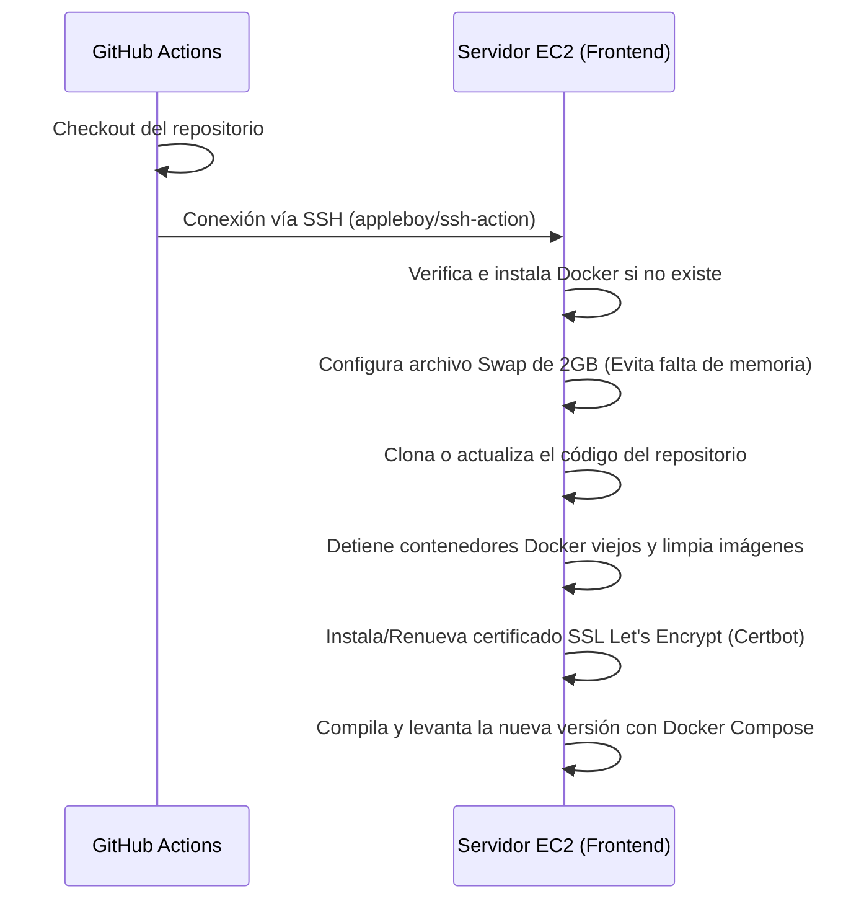

# 🚀 Guía de Despliegue y DevOps del Frontend

Esta guía detalla los procesos de empaquetado, contenedores locales y producción, configuración de red en Nginx y el pipeline de integración y despliegue continuo (CI/CD) para el Frontend de **OutfitGo**.

---

## 🐳 1. Configuración de Entornos de Ejecución

El Frontend utiliza contenedores Docker para garantizar la paridad entre entornos de desarrollo y producción.

### 1.1 Entorno de Desarrollo Local
Ubicación: `/Frontend/docker-compose.yml` y `Dockerfile`

*   **Propósito**: Levantar un servidor local de Angular sin instalar Node.js directamente en el sistema host.
*   **Comandos de Arranque Rápidos**:
    ```bash
    # Levantar el contenedor
    docker-compose up -d
    # Acceder al contenedor e instalar dependencias
    docker-compose exec frontend bash
    npm install
    # Iniciar servidor con recarga automática
    ng-serve
    ```
*   **Volumen de Trabajo**: Vincula el código local con la carpeta `/app` del contenedor para reflejar los cambios al instante.

---

### 1.2 Entorno de Producción
Ubicación: `/Frontend/docker-compose.prod.yml` y `Dockerfile.prod`

El contenedor de producción realiza una compilación multi-etapa (*multi-stage build*):
1.  **Etapa de Compilación**: Usa una imagen base de Node para descargar dependencias y compilar el proyecto en modo producción (`ng build --configuration=production`).
2.  **Etapa de Servidor**: Toma el empaquetado resultante (`dist/outfit-go-angular19/browser`) y lo inyecta dentro de un contenedor **Nginx** optimizado para servir los archivos estáticos en los puertos 80 y 443.

---

## 🌐 2. Servidor Web de Producción (Nginx)

El archivo de configuración `/Frontend/nginx.conf` es crítico porque maneja tanto el servicio del Frontend como el proxy inverso hacia la API del Backend.

### Configuración de SSL y Certificados (Actual)
*   **Puerto 443**: Escucha peticiones seguras HTTPS utilizando los certificados Let's Encrypt generados en el servidor de AWS.
*   **Certificados**: Mapeados desde la máquina virtual host al contenedor mediante volumen:
    ```yaml
    volumes:
      - /etc/letsencrypt:/etc/letsencrypt:ro
    ```

### Enrutamiento de Proxy Inverso (CORS & API)
Nginx intercepta las llamadas que van a `/api` o `/storage` y las reenvía de forma transparente a la IP privada del Backend de Laravel dentro de la red privada (VPC) de AWS:
```nginx
location /api {
    proxy_pass http://172.31.39.131; # IP Privada del Backend EC2
    proxy_set_header Host $host;
    proxy_set_header X-Real-IP $remote_addr;
    proxy_set_header X-Forwarded-For $proxy_add_x_forwarded_for;
    proxy_set_header X-Forwarded-Proto $scheme;
}
```

---

## 🔄 3. Pipeline de CI/CD (GitHub Actions)

Ubicación: `/Frontend/.github/workflows/deploy.yml`

El despliegue está automatizado. Cada vez que se realiza un `push` a la rama `main`, se ejecuta el siguiente flujo:



### Secretos Requeridos en GitHub
Para que el despliegue automático funcione, se deben configurar las siguientes variables en **Settings > Secrets and variables > Actions**:

*   `FRONTEND_HOST`: Dirección IP pública de la instancia EC2 de frontend.
*   `SSH_KEY`: Clave privada `.pem` completa de AWS para autorizar la conexión.
*   `USER`: Usuario SSH por defecto de la AMI (usualmente `ubuntu`).
*   `BASTION_HOST`: Dirección IP de la máquina salto (Bastion Host) que protege el acceso a la subred.

---

## ⚖️ 4. Integración Futura con el Balanceador de Carga

Cuando se configure el **Balanceador de Carga (EC2 Nginx)** al final del proyecto, el esquema de despliegue del frontend se simplificará eliminando la sobrecarga de seguridad local:

1.  **Eliminación de SSL en Frontend**: 
    *   Nginx en el contenedor de Angular ya no necesitará escuchar en el puerto `443` ni montar certificados SSL locales, ya que la conexión segura se descifrará (terminación SSL) en el propio Balanceador.
    *   La comunicación del Balanceador al Frontend será por el puerto interno `80`.
2.  **Eliminación de Certbot en Despliegue**:
    *   Se eliminarán las directivas de instalación de Certbot en el script de `deploy.yml`.
3.  **Eliminación de Proxies**:
    *   Las redirecciones a `/api` o `/storage` se gestionarán mediante reglas de rutas en el Balanceador Nginx, eliminando la necesidad de que el Frontend actúe como proxy del Backend.
